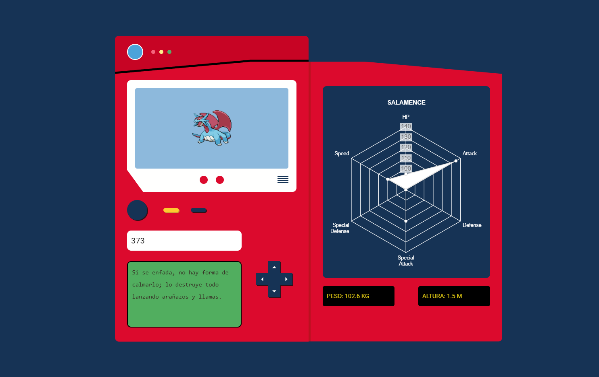

# Taller: Creando una Pokédex interactiva 

Este proyecto es parte del Taller **Creando una Pokédex interactiva** de
[leonidasesteban.com](https://leonidasesteban.com/aprender/pokedex)

El proyecto consiste en realizar una increible Pokédex, consumiendo la api de [pokeapi.co](https://pokeapi.co/), pero hubo unos retos y cosas que agregue que me gustaron mucho:

| Acciones   |  |
| ------ | ------   |
| Botón para buscar Pokémon aleatoriamente |   :heavy_check_mark:  |
| Se agrego caracteristica de Altura y Peso |  :heavy_check_mark:   |

Las tecnologias usadas son las siguientes:

* HTML, CSS y Javascript
* Chart.js
* SpeechSynthesis
* Api de Pokeapi

### Demo :computer:

Has click en el enlace para ver el  **[resultado](https://cesarchoqueskater.github.io/pokedex-javascript/)** 

### Imagenes :camera:

